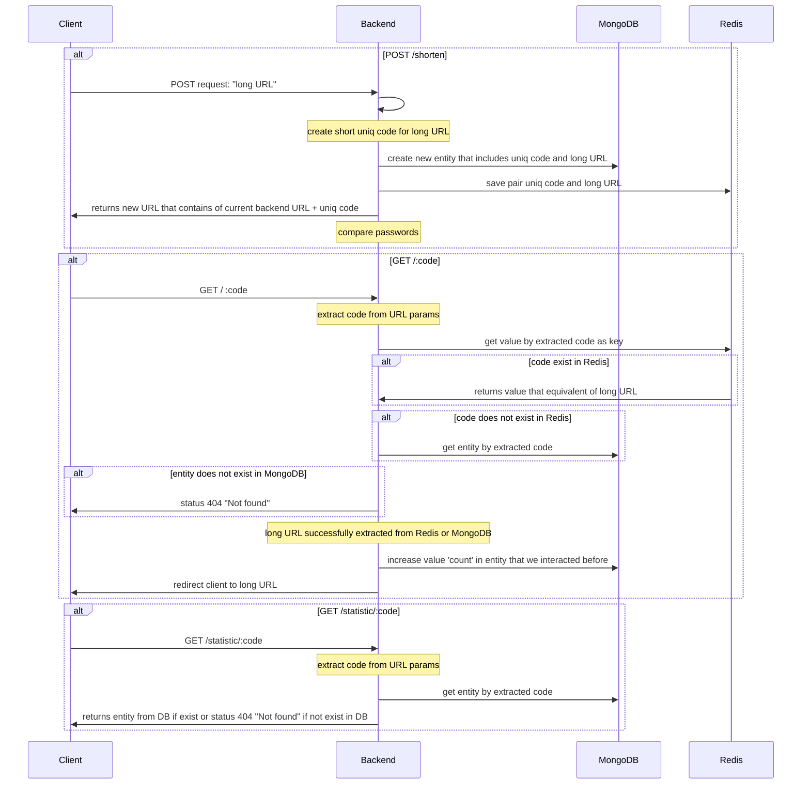

#
simple URL shortener API
## Contents

1. [Getting started](#getting-started)
    1. [Requirements](#requirements)
    2. [Project configuration](#project-configuration)
    3. [Running the app](#running-the-app)
    5. [Tests](#test)

2. [Project structure](#project-structure)
3. [Project flow](#project-flow)
 

#
# Getting started

## Requirements

| Technology| VERSION |
| --------- | ------- |
| NodeJS    |  22.7   |
| NestJS    |  10.4.7   |
| NPM       |  10.8.2   |
| MongoDB   |  6.0    |
| Redis     |  7.4.1    |


To change nodejs and npm version use [nvm](https://github.com/nvm-sh/nvm/blob/master/README.md).


## Project configuration

```bash
$ git clone git@github.com:vlmaslennikov/url_shortener_api.git
 
$ cd url_shortener_api/
 
$ npm ci
```
After installing the dependencies, you should set up your project by creating a new `.env` file like `.example.env`, containing the environment variables used for development.

## Running the app

```bash
# development
$ npm run start

# watch mode
$ npm run start:dev

# production mode
$ npm run start:prod
```

## Test

```bash
# run unit tests
$ npm run test
```

## Code style
I use airbnb code style 

[Airbnb documentation](https://github.com/airbnb/javascript)

[npm eslint-config-airbnb](https://www.npmjs.com/package/eslint-config-airbnb)

## Project structure

```sh
project-backend/    
└──  src
    ├── modules   
    │   ├── app.module.ts   
    │   └── short-link-data  
    │       ├── dto/  
    │       ├── schema/  
    │       ├── types/  
    │       ├── short-link-data.controller.ts
    │       ├── short-link-data.controller.spec.ts # unit tests
    │       ├── short-link-data.service.ts  
    │       ├── redis-internal.service.ts  
    │       ├── short-link-data.repository.ts
    │       └── short-link-data.module.ts
    │        
    ├── providers
    │   ├── mongo/ 
    │   └── redis/ 
    │        
    ├── shared 
    │   ├── config/
    │   ├── filters/
    │   ├── utils/
    │   └── throttler/
    │    
    └── main.ts  
 ```

## Project flow


 
 

 


